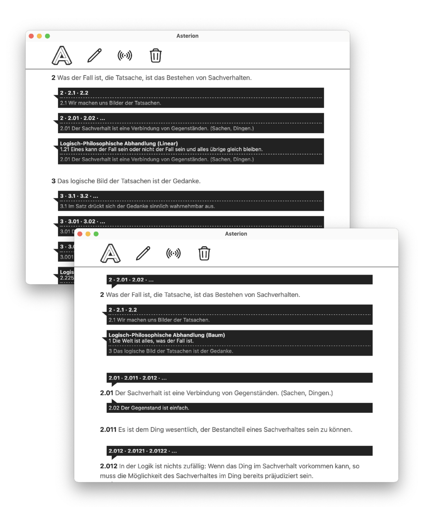

# Hypertext Explorations

I built several prototypes of hypertext systems between 2019 and 2023, all focused on the idea of linking _snippets_ of text _implicitly_ and _bidirectionally_ when they appear in different contexts/documents, instead of creating explicit jump-links like on the web.

The various experiments are attempts to reimagine and prototype a different vision of the web as connected and _overlapping_ documents/pages/media. The resulting system works similar to a wiki and shares a few similarities with Ted Nelson's [ZigZag](https://xanadu.com/zigzag/). It grew out of a hypertext system for Wittgenstein's philosophical Nachlass, a philosophical corpus of 20.000 pages with a strikingly non-linear structure. It is also vaguely inspired by Deleuze and Guattari's [rhizome](https://en.wikipedia.org/wiki/Rhizome_(philosophy)) and McLuhan's notion of acoustic space. One aim of the project was to explore how theoretical ideas about non-linear structure can be turned into software and used practically.

## Asterion (2023)

Asterion is an experimental app for non-linear reading and writing that links together similar snippets using a _subway metaphor_, where similar snippets form the _stations_ and the documents they appear in form the _lines_ that connect them. Whenever a snippet appears in different documents, Asterion automatically displays _bidirectional branches_ to other documents.

The app is built with Tauri, the similarity search is a custom inverted index using n-grams, all data is stored in a simple log-structured KV store written in Rust.

## AssemblageDB (2021)

[AssemblageDB](https://github.com/fkettelhoit/assemblagedb) is a transactional high-level database for connected webs of pages, notes, texts and other media. Think of it like a _personal web,_ but easily editable, with more connections and better navigation than the web. It is high-level in the sense that it defines a document model similar to HTML but vastly simpler and with graph-like 2-way links instead of tree-like 1-way jump links. The data model is both:

- _document-oriented:_ supports nested documents without a fixed schema
- _graph-based:_ documents can have multiple parents and form a directed graph

All data is automatically indexed and supports similarity search using an inverted index built on n-grams. This allows efficiently finding similar snippets, which are linked automatically.

The DB is built on top of [AssemblageKV](https://github.com/fkettelhoit/assemblagedb/tree/main/assemblage_kv), a simple embedded key-value store with [MVCC](https://en.wikipedia.org/wiki/Multiversion_concurrency_control) implemented in 100% safe Rust as a log-structured hash table similar to [Bitcask](https://riak.com/assets/bitcask-intro.pdf). Writes of new or changed values never overwrite old entries, but are simply appended to the end of the storage. Old values are kept at earlier offsets in the storage and remain accessible. An in-memory hash table tracks the storage offsets of all keys and allows efficient reads directly from the relevant portions of the storage. A store can be merged, which discards old versions and builds a more compact representation containing only the latest value of each key.

## Wittgenstein Übersicht (2019)

I first started working on a hypertext system at the Wittgenstein Archives Bergen, built specifically for linking together similar documents and snippets in Ludwig Wittgenstein's philosophical corpus (consisting of about 20 000 pages).

The system isn't public available (because the XML sources of the Wittgenstein corpus unfortunately haven't been released under an open license), but I gave a [short talk](https://www.youtube.com/watch?v=NX6JYDlJB6U) presenting a prototype to a philosophical audience.
