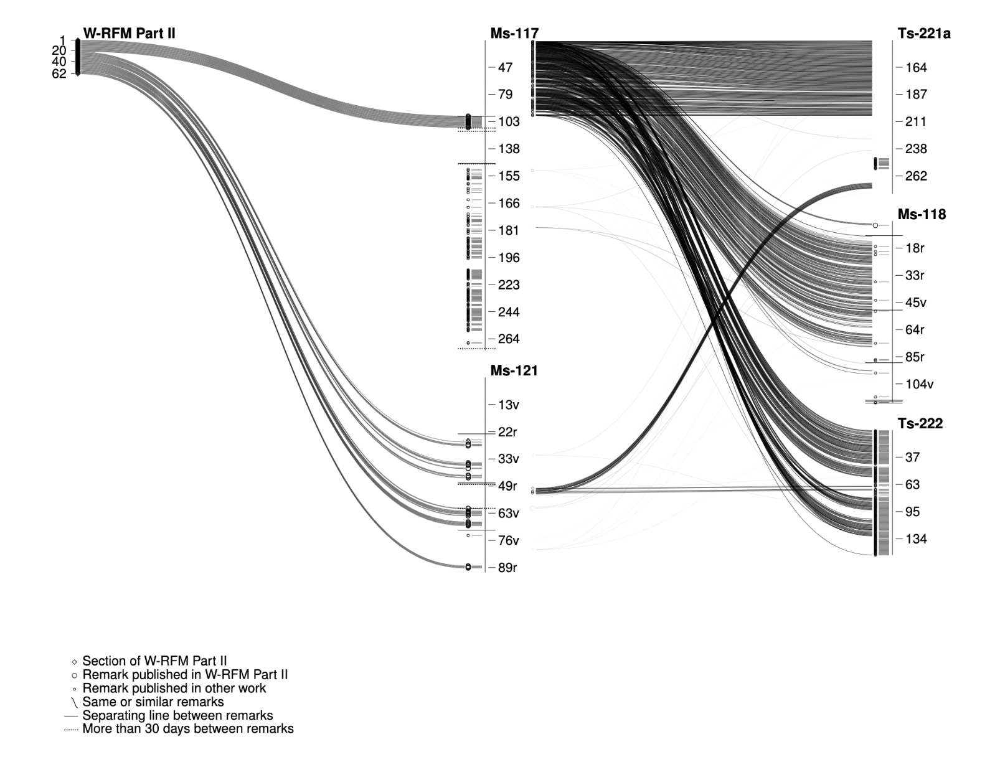
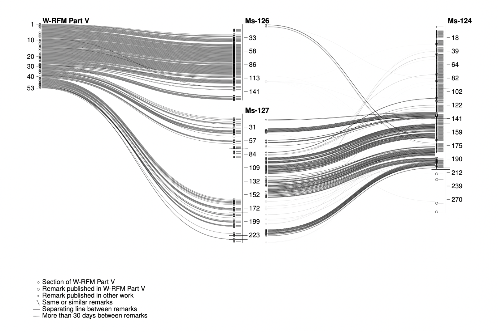

# Visualizations of Wittgenstein's Nachlass

[github.com/fkettelhoit/wittgenstein-work-sources-viz](https://github.com/fkettelhoit/wittgenstein-work-sources-viz)

As part of my PhD, I created visualizations of the correspondence between Ludwig Wittgenstein's posthumous works (edited by the Nachlass executors) and the sources in Wittgenstein's own documents in the Nachlass, especially for the _Remarks on the Foundations of Mathematics_.

Here are some examples:

## The Problem of Wittgenstein's "Works"

The "works" of Wittgenstein that were published after his death by the three literary executors G.E.M. Anscombe, Rush Rhees and Georg Henrik von Wright have often been the target of criticism, giving rise to the question of what can even be considered a "work" by Wittgenstein. The _Remarks on the Foundations of Mathematics_ (RFM), first published in 1956 and then heavily revised and expanded in 1974, are certainly one of the most problematic publications in this regard, as the literary executors themselves pointed out:

> The _Remarks on the Foundations of Mathematics_ occupy a nearly unique, and not altogether happy, position among the posthumous publications. In addition to the relatively finished Part I, corresponding to typescripts 222, 223, and 224 of the catalogue and constituting the second half of the pre-war version of the _Investigations_, the _Remarks_ contain _selections_ from several manuscripts (117, 121, 122, 124, 125, 126, and 127). In the revised edition of 1974 (English translation 1978) the selections from those manuscripts were somewhat enlarged and a further manuscript (164) which was not known to the editors at the time of the first edition was added, practically without omissions. A publication of the manuscripts _in toto_, however, seemed to us excluded even at the time of preparing the new edition.
>
> —von Wright, "Philosophical Occasions", 1993, p. 502
