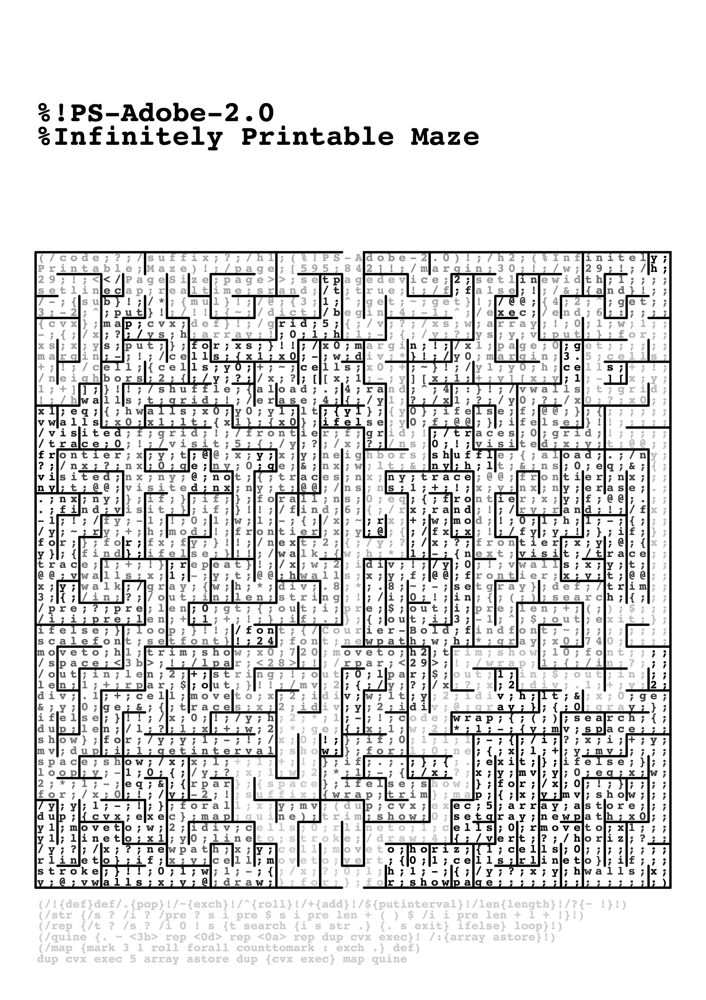
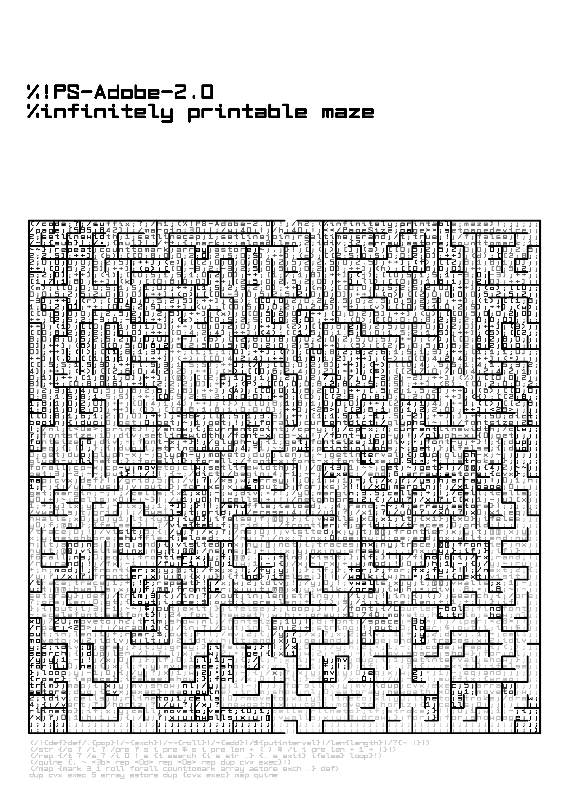
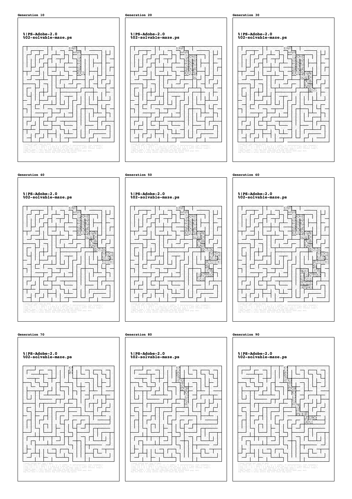

# Infinitely Printable Maze

[github.com/fkettelhoit/postscript-maze-quine](https://github.com/fkettelhoit/postscript-maze-quine)

The _Infinitely Printable Maze_ is a quine, a program that represents its own code, written in PostScript, Adobe's page description language from 1982, the language of printers. Unlike a pdf, the Infinitely Printable Maze is not a dead document, but draws a different maze each time it executes itself during printing.

Why program by hand in PostScript? Why write a program that draws itself and thus makes its own form the subject, exposes itself? Why draw itself (in/as) a labyrinth, deliberately concealing itself?

How reproducible is a document that perfectly reproduces its own code, its own instructions, but draws itself differently with each print, making each copy unique?

