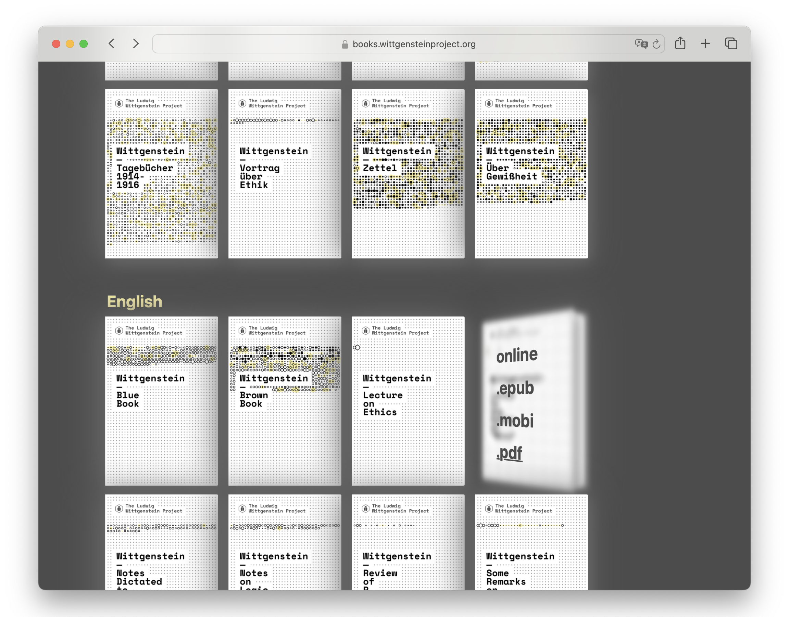
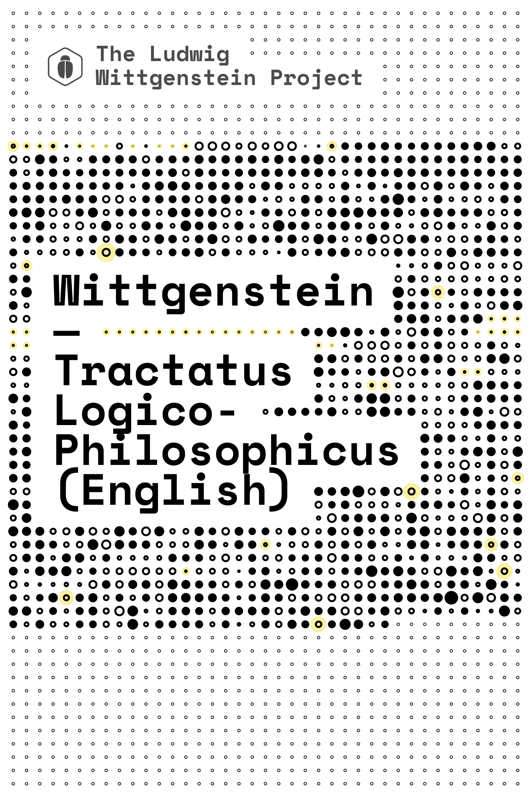

# Ebooks for the Wittgenstein Project

[github.com/wittgenstein-project/wittgenstein-project.github.io](https://github.com/wittgenstein-project/wittgenstein-project.github.io)

I wrote several scripts that automatically generate versions of Ludwig Wittgenstein's works in different file formats, such as Markdown, ebooks (.epub and .mobi) and PDFs, based on the public domain editions provided by the Ludwig Wittgenstein Project.

Hosted on [books.wittgensteinproject.org](https://books.wittgensteinproject.org).

## Generative Cover Art

The covers are automatically generated and reflect the structure of each book.

