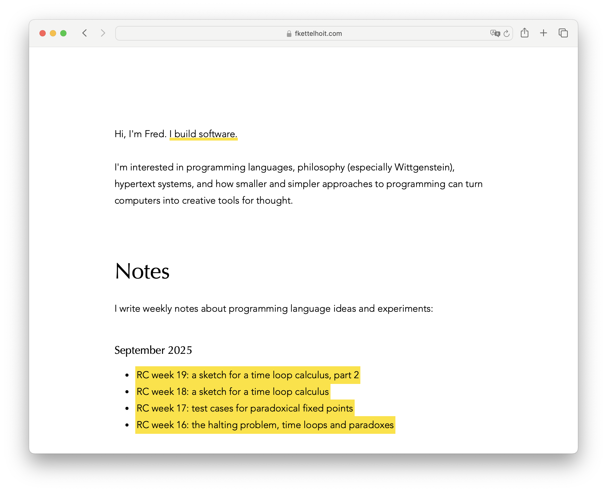
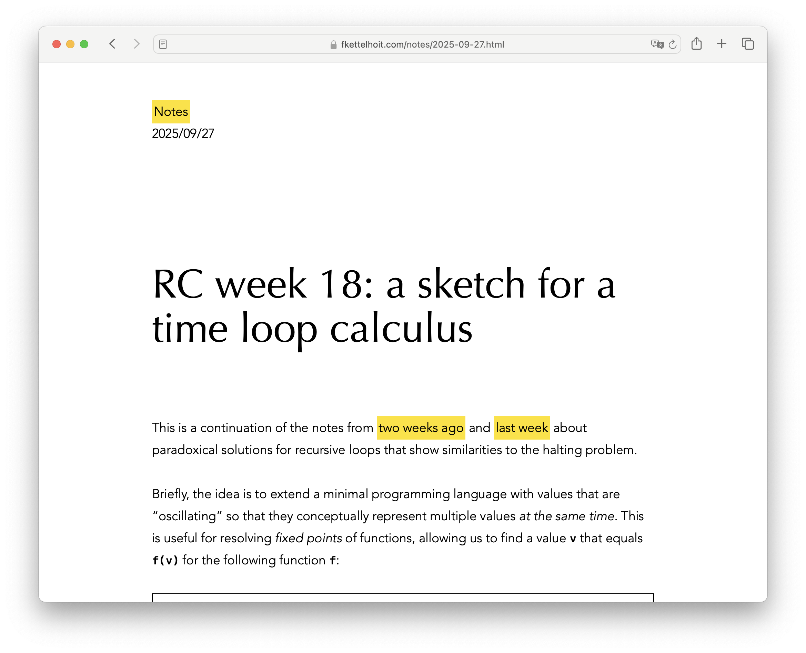
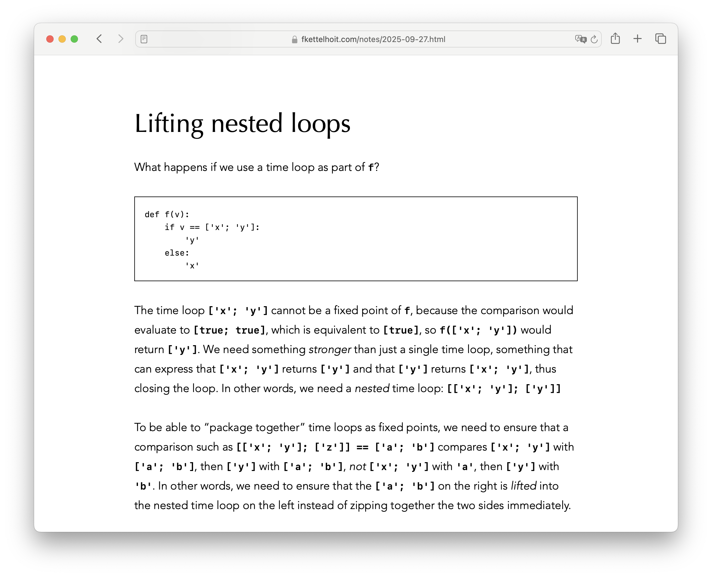
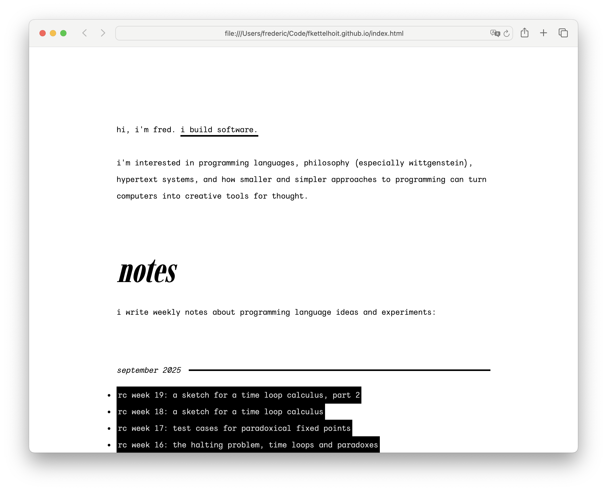
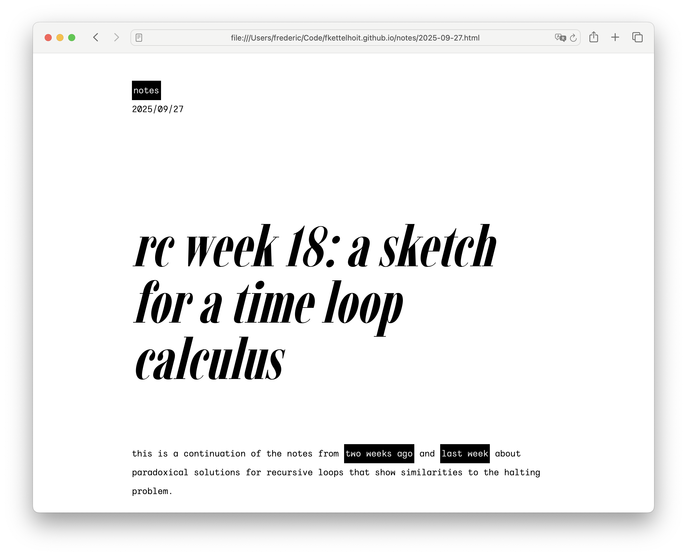
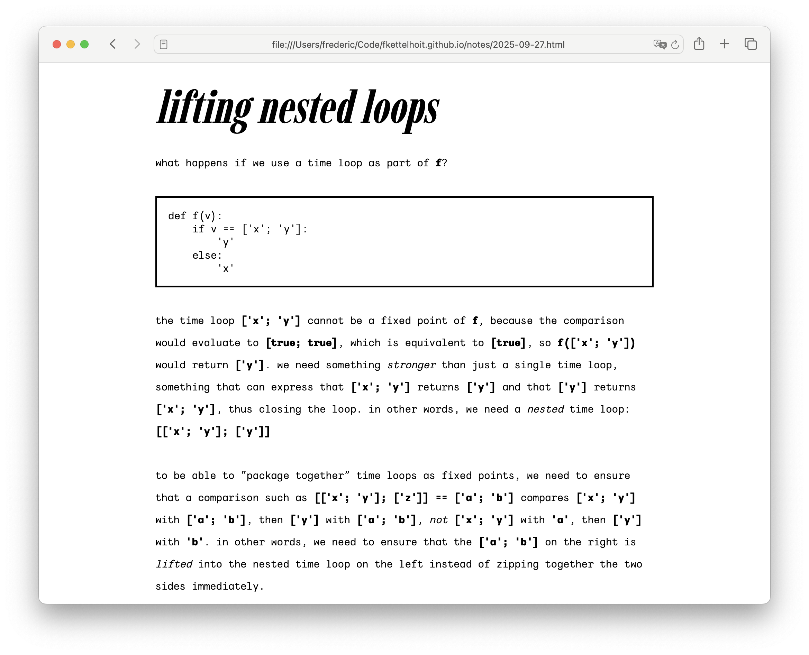

# Redesigning my website to be more kiki

After 19 weeks at the Recurse Center, my [volitional muscles](https://www.recurse.com/self-directives) are sore, so didn't touch any code and instead redesigned my website to be more [kiki](https://en.wikipedia.org/wiki/Bouba/kiki_effect), inspired by viola's [recent redesign](https://viola.city/).

## Minimal, malleable and small-scale

I wanted a design that was more in line with [Kombucha's](https://github.com/fkettelhoit/kombucha) values: I wanted to build something simple from the ground up, saying no to complexity whenever possible, even if that meant that the end result ended up too austere for anyone but me. Something minimal, something [home-cooked](https://www.robinsloan.com/notes/home-cooked-app/), something small enough that I can grasp and control it.

Here's my wish list:

- Ideally less than 100 lines of CSS.
- No build pipeline, no CSS preprocessing.
- Using a subset of HTML/Markdown, using my own parser.
- A limited color palette, a single highlight color.
- A high [data-ink ratio](https://en.wikipedia.org/wiki/Edward_Tufte#Information_design).
- A single linear flow that's automatically responsive.
- Just 2 or 3 typefaces.

## Before

## After

## Imbue and Wintyr

The previous version was somewhat clean, but also a bit bland. I wanted to use [system fonts](https://modernfontstacks.com/) and ended up with _Avenir_ for the body and _Optima_ as the display face. I _love_ Avenir, it's wonderfully versatile and yet has a lot of character. But, let's be honest, pairing a geometric with a humanist typeface isn't exactly daring. In fact, it's a pretty safe choice and that's exactly what the design looked like.

(Worse, these specific typefaces are the best case scenario on platforms that have them, which in practice means iOS and macOS. On Windows, Linux or Android, the pairings were not exactly as nice.)

What I had actually wanted to use as a display face was a _Didone_, because the high contrast and principled approach to serifs seemed like a good fit for the aesthetic I was going for. Listen, it's not my fault that Didones are nowadays mostly associated with fashion magazines. Blame Vogue, not me.

Oh, and I wanted open-source fonts, which makes this quite a bit harder.

Which brings me to [Imbue](https://etceteratype.co/imbue), a condensed Didone designed by Ty Finck of Etcetera Type Company and [League of Moveable Type](https://www.theleagueofmoveabletype.com/) fame. It's everything I wanted, and more (it's condensed and it's a variable font).

I briefly experimented with [IBM Plex Mono](https://www.ibm.com/plex/plexness/), because, well, as the IBM website says, it has _plexness_. Seriously though, the italic is wonderful and I like the idea of using a monospace italic as the body typeface without pairing it with its roman counterpart, because it would mix the contemporary (monospace for the body) with the historical (an italic as a distinct type). Then again, choosing a typeface designed by and for _IBM_ of all companies doesn't exactly scream small-scale and malleable, does it?

I almost settled on [Sono](https://etceteratype.co/sono) for the body. It's a lovely typeface and notably supports a smooth transition between monospace and proportional styles. The result is body copy that has the same smooth rhythm and spacing as proportional type, but looks inspired by a monospace aesthetic and integrates seamlessly with code samples that use Sono's mono variant. Best of all, it would allow me to use _proportional_ type for the inline code snippets, while still looking recognizably like the font used in monospace code blocks. The only problem is that Sono is too [bouba](https://en.wikipedia.org/wiki/Bouba/kiki_effect) for what I wanted, because it's noticeably soft in heavier weights.

Then I browsed through Ty Finck's new project, [Public Type Works](https://publictype.works/), which sells font licenses using a kickstarter-like model: You immediately get the font (+ license) when you pay for it, and the font is made open-source when the full funding goal is reached. Which brings me to [Wintyr](https://publictype.works/font/wintyr/), which was exactly what I was looking for: monospace and very kiki. (It even supports a few nice stylistic alternatives such as a single-story a.)

The rest emerged naturally from the type. High contrast colors, a functional and austere aesthetic, with noticeable lines and borders as a nod to the _Bauhaus_ tradition. The various Bauhaus publications that eschewed capitals were the inspiration to go all lowercase (as well as the unofficial “lowercase club” at the Recurse Center).

I'm pretty happy with the result. After all,

> High contrast, it's cool

—[Kylie Minogue](https://en.wikipedia.org/wiki/GBI_%28German_Bold_Italic%29)
