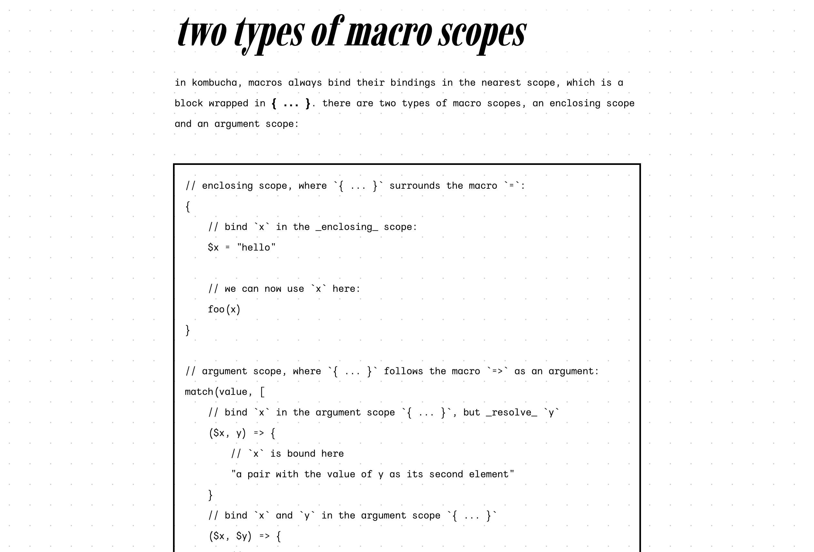
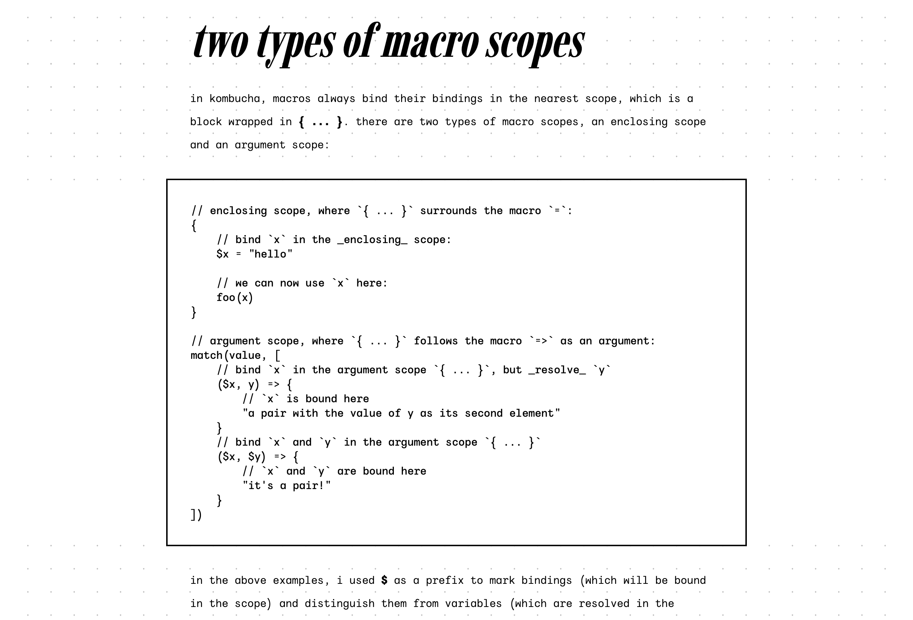
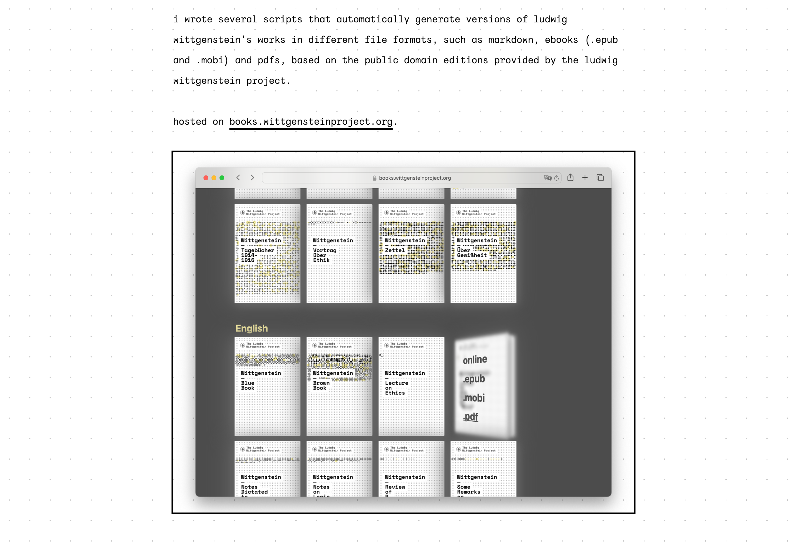
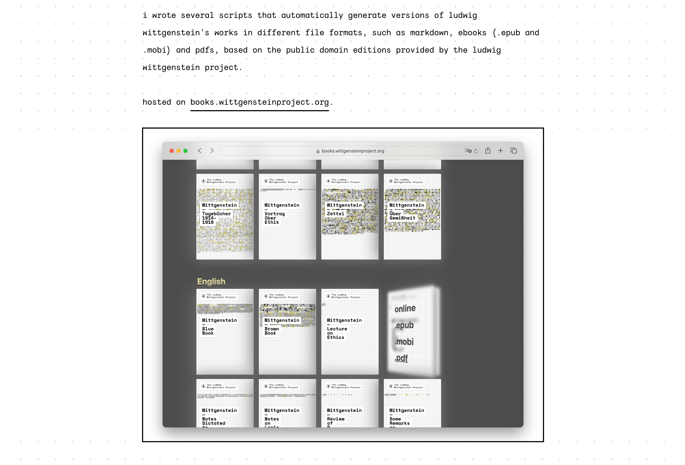

# Against the web's grain

CSS can be contorted into almost any shape. But when you don't pay attention to its [grain](https://frankchimero.com/blog/2015/the-webs-grain/), it might start to creak, and sometimes, when you push a bit and expect it to respond gently to your touch, it doesn't bend gracefully, it breaks.

For a few months now, my design has been built around a dot grid pattern of 24pt by 24pt. All of the various elements were specified in terms of this [typographic grid system](https://monoskop.org/images/a/a4/Mueller-Brockmann_Josef_Grid_Systems_in_Graphic_Design_Raster_Systeme_fuer_die_Visuele_Gestaltung_English_German_no_OCR.pdf), with all line heights specified as multiples of 24pt. Well, _almost_ all of the various elements, because there were two elements that resisted any attempts to align them on the grid: `img` and `pre` elements.

`pre` elements could be grid-aligned, but only by sticking to the same restrictive line height that was used for the body text, which made the code blocks look either extremely cramped or loose. And with images taking up 100% of the content width, I would have needed to either crop or pad their height to multiples of the grid size, which is (to my knowledge) not possible without resorting to JS (which is how [The Monospace Web](https://owickstrom.github.io/the-monospace-web/) does it, more details [here](https://wickstrom.tech/2024-09-26-how-i-built-the-monospace-web.html#the-media-elements)).

I was trying to go against the web's grain by forcing elements to fit rules that made sense in print design but less so on the web. Not only was the design starting to creak, it was encrusted with enough ornamentation that it [collapsed under its own weight](https://en.wikipedia.org/wiki/%C3%80_rebours).

The solution is simple: Go with the grain. For most elements, that means aligning them to the grid, but for `pre` and `img` elements, it means suspending the grid and resuming it afterwards. Not only do these elements get the breathing room they need, the resulting design is also less likely to break in catastrophic ways, because each element is in charge of drawing its own grid background. (Previously, there were situations where margin collapse could lead to a misalignment that would then affect everything that followed). I also changed the link underlines and list bullet points to be grid-aligned:

## Pre, before & after

## Img, before & after

## Underlines + bullets, before & after

