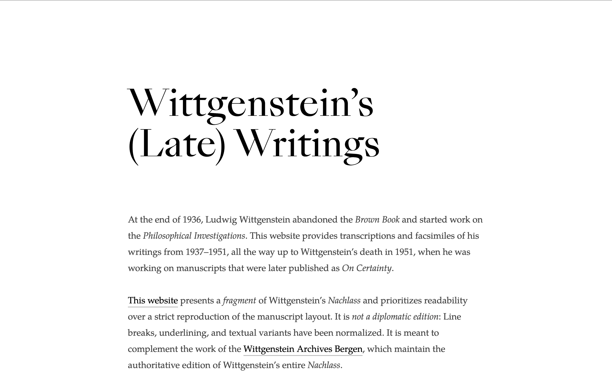
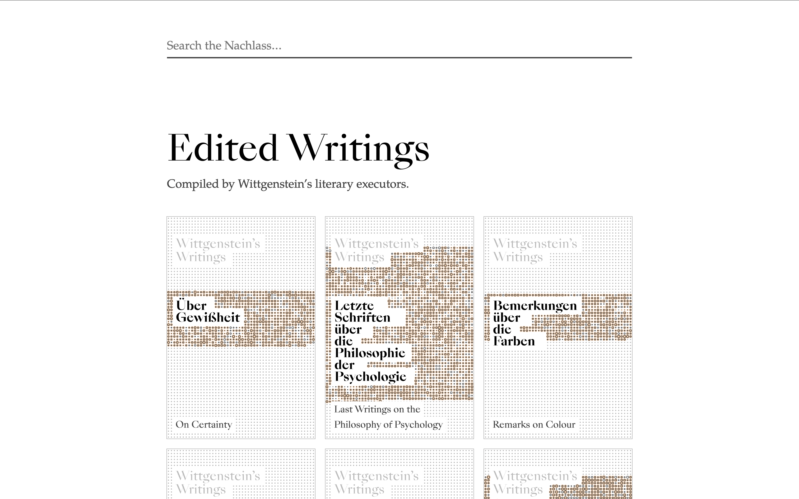
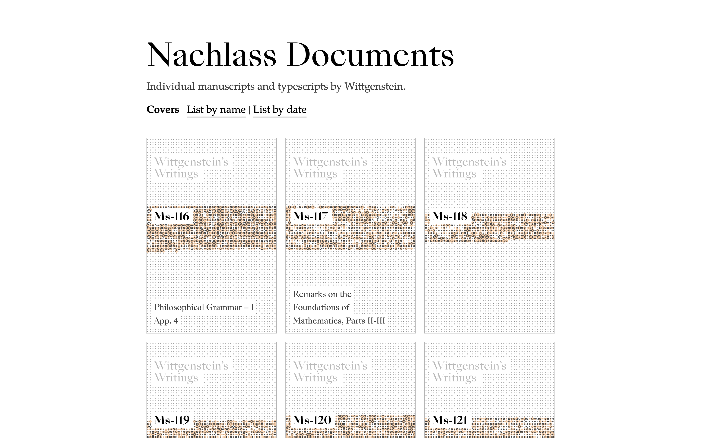
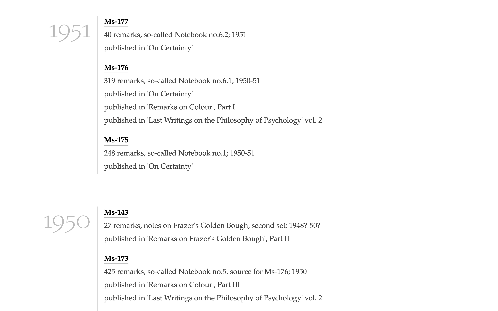
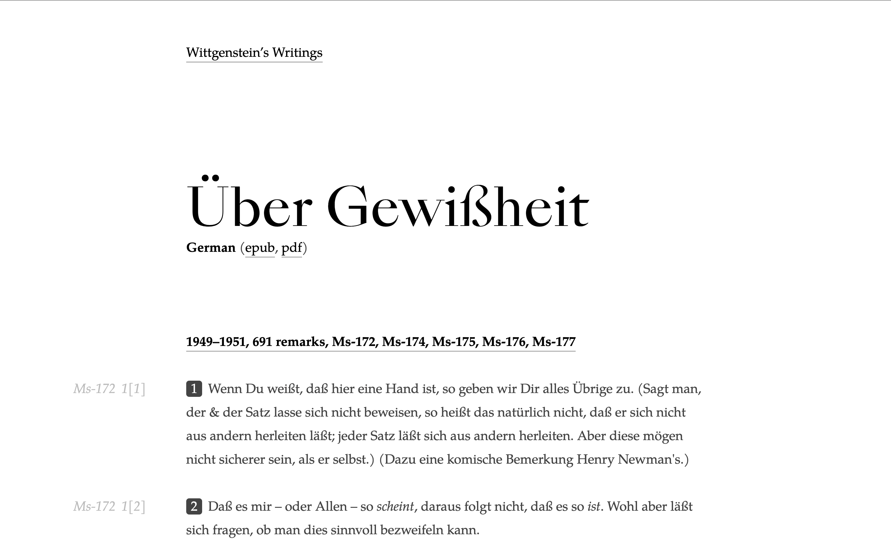
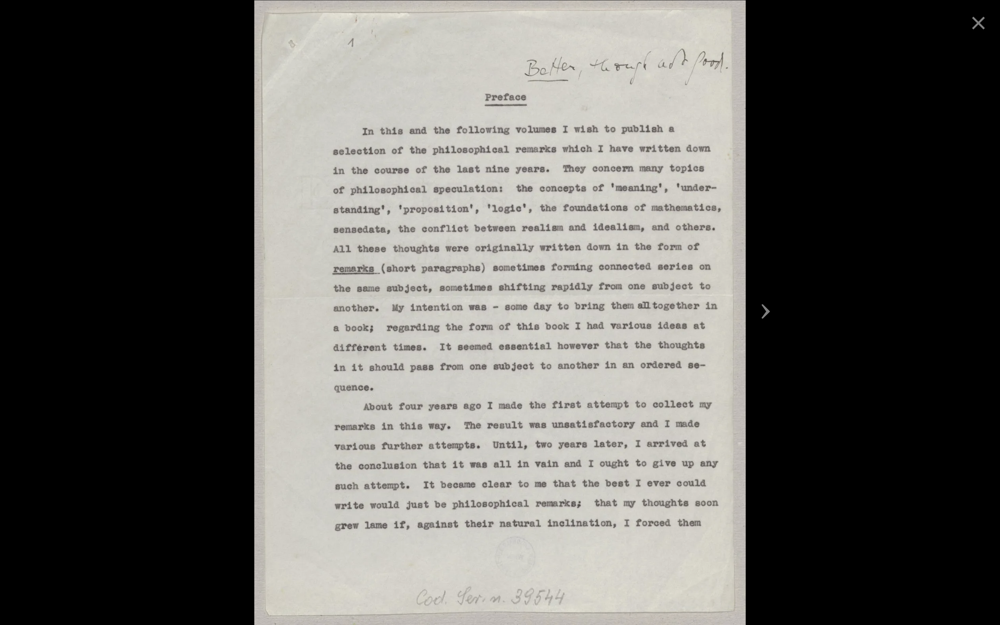
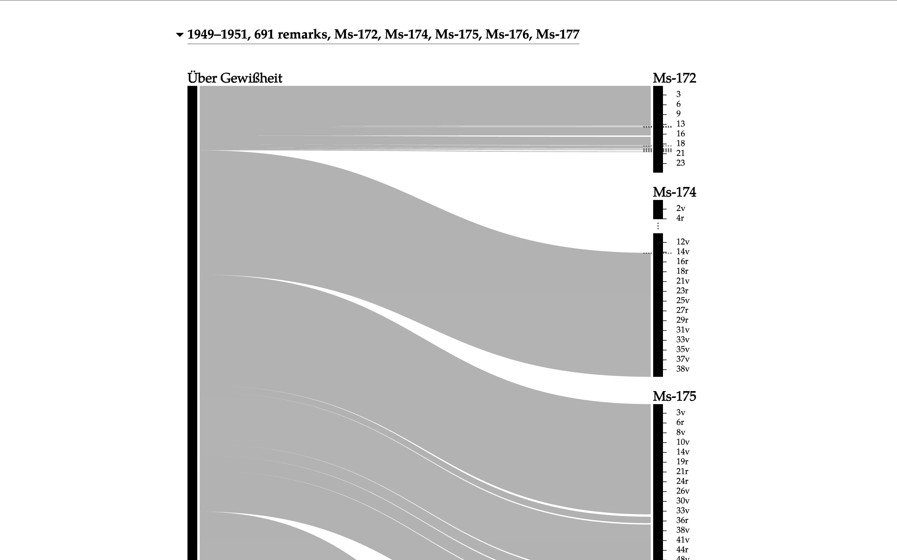
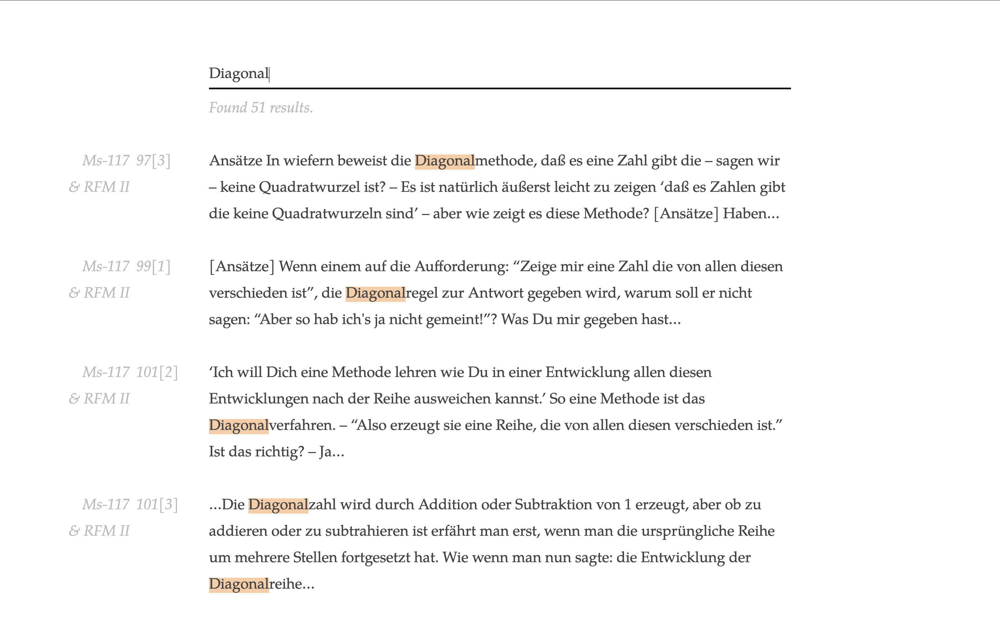

# A new edition of Wittgenstein's (late) writings

For the past three months, I've been working on a new online edition of Ludwig Wittgenstein's philosophical writings, commonly known as _Wittgenstein's Nachlass_. It has finally reached a point where it's ready to be shared:

[wittgensteinnachlass.com](https://www.wittgensteinnachlass.com/)

The website currently contains the writings from the last 15 years of Wittgenstein's life, from the period 1937 to 1951. (Almost everything is in German, but English translation might be added soon.) The website provides access both to the original documents (manuscripts and typescripts written by Wittgenstein) and to the “published works” that were compiled from these documents by Wittgenstein's literary executors after his death, such as “Philosophische Untersuchungen” (“Philosophical Investigations”) and “Über Gewißheit” (“On Certainty”).

## Facsimiles

The new website is the first edition that links between the published works and their source documents, which makes it easy to trace the origin of the published remarks. It also links to the facsimile pages for each remark.

## Visualizations

The website also provides all documents and published works as epub and pdf files in addition to their online versions, and contains data visualizations for the relationship between the remarks in the published works and the source documents. I also threw in cover images that double as data visualizations, as well as full text search.

## Editorial challenges

Publishing Wittgenstein's Nachlass has been a pretty cursed undertaking at times, for a couple of reasons. The main reason is the sheer size of the Nachlass, all in all about 20,000 pages. This makes it mostly impossible to solve layout issues on a case by case basis or proofread every document by hand.

The other reason is that Wittgenstein's notebooks contain a lot of (sometimes ad-hoc) mathematical notation and drawings. While publishing the non-mathematical parts of the Nachlass documents is (mostly) straightforward, the mathematical writings often required coming up with typographic case by case solutions and some pretty questionable MathML encodings. This work is far from done, but it should be good enough that the large majority of remarks are displayed correctly. And for the really weird remarks there's always a link to the facsimile pages.
